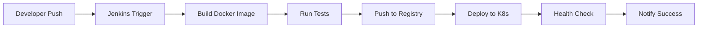

# CI/CD Pipeline for Algorithm Visualizer

This repository contains a complete CI/CD pipeline setup for deploying the Algorithm Visualizer application to Kubernetes using Jenkins on AWS.

## 🚀 Quick Start

### Prerequisites
- AWS Account with appropriate permissions
- Docker Hub account
- Git repository access

### 1-Minute Setup
```bash
# Clone the repository
git clone https://github.com/anshthakur0999/algorithm-visualizer.git
cd algorithm-visualizer

# Configure environment
cp .env.example .env
# Edit .env with your settings

# Set up AWS infrastructure
chmod +x scripts/*.sh
./scripts/setup-eks-cluster.sh
./scripts/create-jenkins-ec2.sh

# Configure Jenkins credentials
./scripts/configure-jenkins-credentials.sh
```

## 📁 Project Structure

```
algorithm-visualizer/
├── 🐳 Docker Configuration
│   ├── Dockerfile              # Multi-stage Docker build
│   ├── nginx.conf              # Nginx configuration
│   ├── docker-compose.yml      # Local development
│   └── .dockerignore           # Docker ignore rules
│
├── ☸️ Kubernetes Manifests
│   ├── k8s/namespace.yaml      # Kubernetes namespace
│   ├── k8s/deployment.yaml     # Application deployment
│   ├── k8s/service.yaml        # Service configuration
│   ├── k8s/ingress.yaml        # Ingress with ALB
│   └── k8s/hpa.yaml            # Horizontal Pod Autoscaler
│
├── 🔧 CI/CD Pipeline
│   └── Jenkinsfile             # Complete Jenkins pipeline
│
├── 🛠️ Infrastructure Scripts
│   ├── scripts/setup-eks-cluster.sh      # EKS cluster setup
│   ├── scripts/create-jenkins-ec2.sh     # Jenkins EC2 creation
│   ├── scripts/setup-jenkins-ec2.sh      # Jenkins installation
│   └── scripts/configure-jenkins-credentials.sh
│
├── 📚 Documentation
│   ├── DEPLOYMENT.md           # Detailed deployment guide
│   └── README-CICD.md          # This file
│
└── ⚙️ Configuration
    ├── .env.example            # Environment template
    └── nginx-proxy.conf        # Proxy configuration
```

## 🏗️ Architecture

### Infrastructure Components
- **AWS EKS**: Managed Kubernetes cluster
- **Jenkins on EC2**: CI/CD automation server
- **Docker Hub**: Container registry
- **AWS ALB**: Application Load Balancer
- **AWS EBS**: Persistent storage

### Pipeline Stages
1. **Checkout**: Source code retrieval
2. **Validate**: Code quality and security checks
3. **Build**: Docker image creation
4. **Test**: Container testing
5. **Push**: Registry upload
6. **Deploy**: Kubernetes deployment

## 🔄 Workflow



## 🛡️ Security Features

### Container Security
- Non-root user execution
- Read-only root filesystem
- Security context constraints
- Resource limits and requests

### Network Security
- Private subnets for worker nodes
- Security groups with minimal access
- TLS encryption in transit
- Network policies (optional)

### Access Control
- IAM roles for service accounts
- RBAC for Kubernetes access
- Secrets management
- Credential rotation

## 📊 Monitoring & Observability

### Health Checks
- Application health endpoints
- Kubernetes liveness probes
- Readiness probes
- Load balancer health checks

### Metrics & Logging
- Container resource metrics
- Application performance metrics
- Centralized logging
- Alerting rules

### Autoscaling
- Horizontal Pod Autoscaler (HPA)
- Cluster Autoscaler
- Vertical Pod Autoscaler (optional)

## 🧪 Testing Strategy

### Local Testing
```bash
# Build and test locally
docker build -t algorithm-visualizer .
docker run -p 8080:8080 algorithm-visualizer

# Test with Docker Compose
docker-compose up -d
curl http://localhost:8080/health
```

### Pipeline Testing
- Syntax validation
- Security scanning
- Container testing
- Integration testing
- Smoke testing

## 🚀 Deployment Options

### Automated Deployment
- Git push triggers pipeline
- Automatic image building
- Rolling updates
- Zero-downtime deployment

### Manual Deployment
```bash
# Build and push manually
docker build -t username/algorithm-visualizer:v1.0.0 .
docker push username/algorithm-visualizer:v1.0.0

# Deploy to Kubernetes
kubectl apply -f k8s/
kubectl rollout status deployment/algorithm-visualizer -n algorithm-visualizer
```

## 🔧 Configuration

### Environment Variables
```bash
# Docker Configuration
DOCKER_HUB_USERNAME=your-username
DOCKER_IMAGE_NAME=algorithm-visualizer

# AWS Configuration
AWS_REGION=us-west-2
EKS_CLUSTER_NAME=algorithm-visualizer-cluster

# Application Configuration
APP_DOMAIN=algorithm-visualizer.yourdomain.com
```

### Jenkins Configuration
- Docker Hub credentials
- AWS credentials
- Kubernetes config
- Git repository access

## 📈 Scaling

### Horizontal Scaling
- Multiple pod replicas
- Load balancing across pods
- Auto-scaling based on metrics

### Vertical Scaling
- Resource limit adjustments
- Node instance type changes
- Storage scaling

## 🔄 Updates & Maintenance

### Application Updates
1. Push code changes to Git
2. Jenkins automatically builds new image
3. Kubernetes performs rolling update
4. Health checks ensure stability

### Infrastructure Updates
- Regular security patches
- Kubernetes version updates
- Node group updates
- Plugin updates

## 🚨 Troubleshooting

### Common Issues
- **Build failures**: Check Jenkins logs and Docker daemon
- **Deployment issues**: Verify Kubernetes resources and events
- **Network problems**: Check security groups and load balancer
- **Performance issues**: Monitor resource usage and scaling

### Debug Commands
```bash
# Check Jenkins
sudo systemctl status jenkins
sudo tail -f /var/log/jenkins/jenkins.log

# Check Kubernetes
kubectl get pods -n algorithm-visualizer
kubectl describe pod POD_NAME -n algorithm-visualizer
kubectl logs -f POD_NAME -n algorithm-visualizer

# Check AWS resources
aws eks describe-cluster --name algorithm-visualizer-cluster
aws ec2 describe-instances --filters "Name=tag:Name,Values=jenkins-server"
```

## 💰 Cost Optimization

### Resource Optimization
- Right-sizing instances
- Spot instances for development
- Reserved instances for production
- Resource limits and requests

### Monitoring Costs
- AWS Cost Explorer
- Resource tagging
- Budget alerts
- Usage monitoring

## 🎯 Best Practices

### Development
- Feature branch workflows
- Code review process
- Automated testing
- Documentation updates

### Operations
- Infrastructure as Code
- Monitoring and alerting
- Backup strategies
- Disaster recovery

### Security
- Regular security updates
- Vulnerability scanning
- Access control reviews
- Audit logging

## 📞 Support

For detailed setup instructions, see [DEPLOYMENT.md](DEPLOYMENT.md).

For issues and questions:
- Check troubleshooting section
- Review logs and events
- Consult documentation
- Open GitHub issue

---

**Built with ❤️ for the DevOps community**
